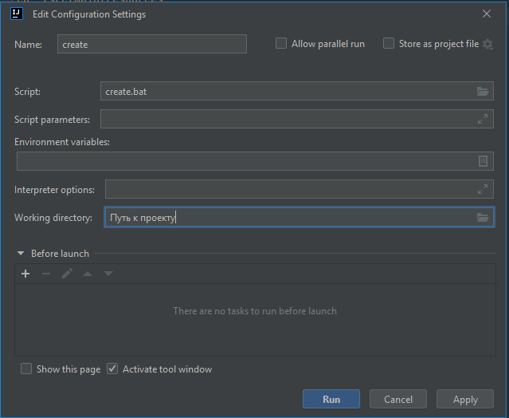

# McScripts
Набор скриптов для создания json-шаблонов предметов блоков (и не только) для ваших модов/ресурспаков minecraft


# Рекомендации использования
Откройте папку проекта вашего мода и в корне создайте скрипт запуска: `create.bat`
```
cd ./src/main/resources
call %путь к питону%/python.exe %путь-к-скриптам%/create.py -sss -nms=%пространство-имен%
```
А так же добавьте запуск скрипта в среде разработки



Теперь вы можете автоматически запустить генератор шаблонов, без необходимости открывать командную строку


# Доступные аргументы
```
-help : показать подсказку
-block: создать блок
        block=block_id
        -ptr=TFF 
        Выбрать что нужно создать для для блока (Block, Stairs, Slab)
        По умолчанию TFF
-item : создать шаблон предмета. 
        -item=item_id
        -texture=texture или -t 
        Если значение не указано, то имя текстуры
        будет такое же как и у json-файла
-nms  : Указывает рабочее пространство. По умолчанию "minecraft"
        В режиме 1-разового использования некоторые команды автоматически
        пространство имен. -block=namespase:block_id

-sss  : Переключает режим единичной команды в режим сессии
-ext  : Завершает работу сессии
-rm   : Переключает с режима добавления в режим удаления
-mini : Минимизирует совместимые json-шаблоны (все кроме ачивок и рецептов)
-adv  : Создает шаблон ачивки разблокировки рецепта

-combo: Создает перегруженную комбинацию моделей
        -item=main_model_path
        -parent=parent_model_path
        -shift=0 : shift CMD to value
        -textures=first,second+tx2_first,tx2_second
        
-craft: Создает шаблон крафта
        -craft=craft_name
        -d or -io: Сгенерировать 2-йной шаблон
        Бывает полезно для шабона блока из слитков и обратного крафта
        -sh or -no-form: Сгенерировать безформенный рецепт
        -adv: Сгенерировать вместе с шаблоном ачивки
```
